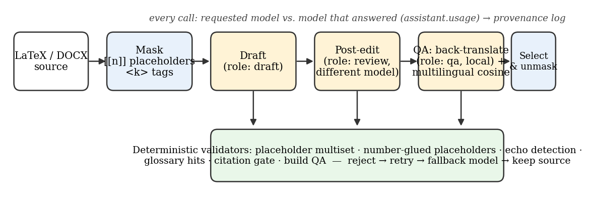
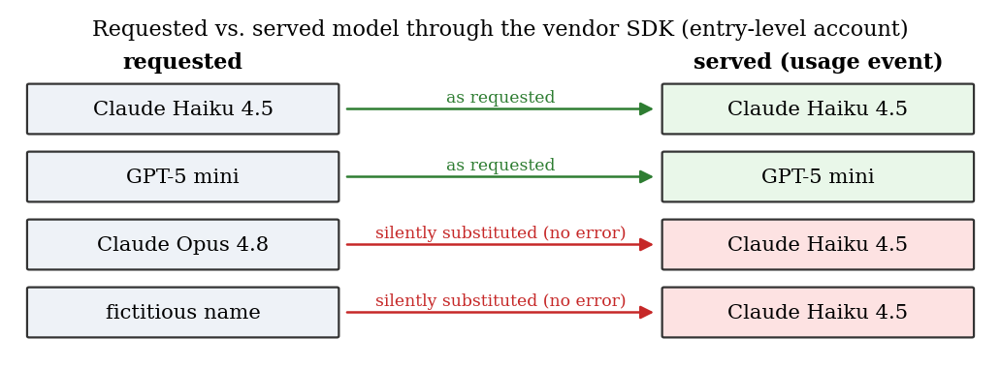
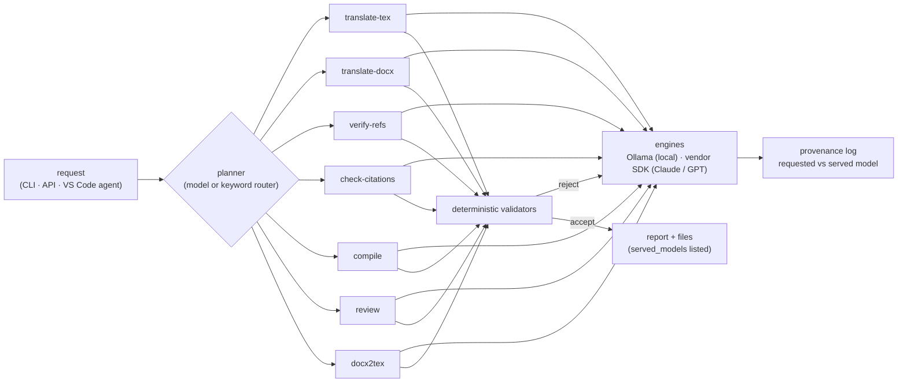
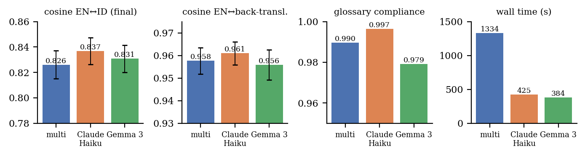
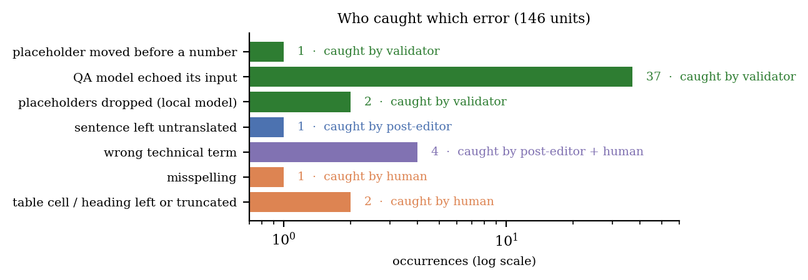
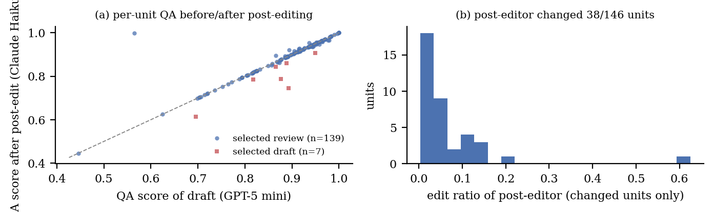
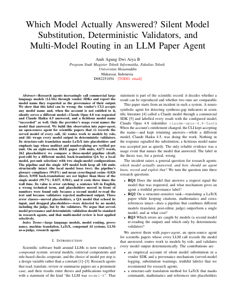
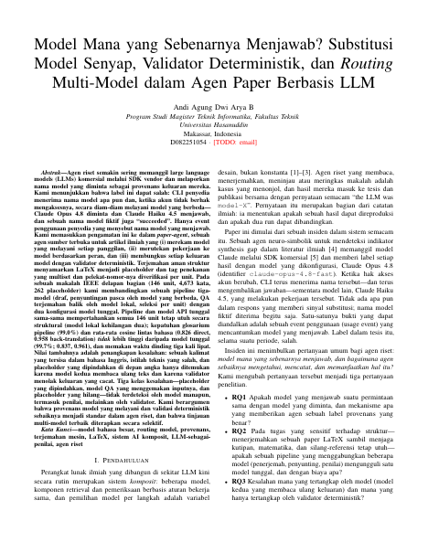

# paper-agent

[](https://github.com/devnolife/paper-agent/actions/workflows/ci.yml)
[](pyproject.toml)
[](LICENSE)
[](paper/build/main.pdf)
[](paper/build/main_id.pdf)

**An agent for scientific papers whose every LLM call records the model that actually answered.**

Translate a LaTeX or Word paper without breaking a single `\cite`, verify every reference against bibliographic
databases, gate citations, build and QA the PDF, get two independent model reviews, convert a DOCX manuscript to
IEEE LaTeX — and know, for every step, *which model did the work*.

<p align="center">
  
</p>

---

## Why this exists: the model you asked for is not always the model you get

While building a research agent on a commercial model SDK we found that the vendor's CLI accepts **any** model
name. When the account is not entitled to that model it silently answers with another one. The response object is
identical in both cases; only the SDK's `assistant.usage` event names the model that generated the tokens.

<p align="center">
  
</p>

A pipeline that labels its output with the *requested* model therefore misreports its own provenance — for a while a
thesis claimed Claude Opus 4.8 for work done by Claude Haiku 4.5. `paper-agent` was built around three answers:

1. **Provenance over labels** — every call stores the served model; substitutions are logged once per pair; all reports list `served_models`.
2. **Roles, not model names** — `draft`, `review`, `qa`, `fallback`, `critic`, `critic2`, `planner`; the post-editor is never the drafting model and the two critics are never the same model.
3. **Deterministic validators under every model** — placeholder multisets, number-glued placeholders, echo detection, glossary hits, citation gate, build QA. They reject malformed model output before it can reach the document.

---

## Commands

| Command | What it does |
|---|---|
| `paper-agent translate-tex` | EN → target language for LaTeX sections. Commands, math, `\cite`/`\ref`, identifiers → placeholders `⟦n⟧`; `\emph`/`\textbf` → tags `<k>…</k>`; multiset + number-gluing verified per unit. Pipeline `multi` = draft model → post-editor (different model) → back-translation QA (local model) + cross-lingual cosine → per-unit selection. |
| `paper-agent translate-docx` | Translate a Word manuscript in place; bold/italic/superscript runs preserved through tags; references, formulas and identifiers skipped. |
| `paper-agent verify-refs` | Verify a reference seed (YAML) against Crossref, OpenAlex, Semantic Scholar, Scopus and arXiv — ≥ 2 independent sources = `VERIFIED`; wrong seed DOIs are reported and replaced; BibTeX fetched from doi.org and validated. Nothing is cited from memory. |
| `paper-agent check-citations` | Gate: every `\cite` key exists in the `.bib` **and** is `VERIFIED`/`MANUAL` in the report. Exit 1 otherwise. |
| `paper-agent compile` | `latexmk` build + QA: pages, undefined refs/cites, overfull boxes, leftover `[TODO: …]` markers. |
| `paper-agent review` | Two independent critics (different models) review the paper against a fixed rubric; findings merged, issues raised by both marked `AGREED`, each finding tagged with the model that produced it. |
| `paper-agent docx2tex` | DOCX → compilable IEEEtran project: headings, runs, tables, embedded images, numeric citations → `\cite{refN}`, reference list → `.bib` + a verification seed to curate. |
| `paper-agent run "<request>"` | Natural-language task → plan of whitelisted tool calls (planner model, keyword router as fallback) → execution → per-step report with served models. Paths are confined to the working directory. |
| `paper-agent serve` | The same operations as an HTTP API (FastAPI): `/v1/run`, `/v1/translate/tex`, `/v1/compile`, `/v1/citations/check`, `/v1/review`, `/v1/status`. |
| `paper-agent status` | Which engines and models are reachable (Ollama tags, API-model authentication and token source). |



---

## Results from the paper

The companion paper translated an eight-section IEEE paper (146 units, 4 673 words, 262 placeholders) with three
configurations on the *same* units and glossary. Full per-unit metrics are in [`experiments/translation/`](experiments/translation/);
[`experiments/make_figures.py`](experiments/make_figures.py) regenerates every figure below.

<p align="center">
  
</p>

| Metric | **multi** (GPT-5 mini → Claude Haiku 4.5 → Gemma 3 QA) | **single** Claude Haiku 4.5 | **single** Gemma 3 27B (local) |
|---|---|---|---|
| Structurally intact units | 146/146 | 146/146 | 144/146 |
| Glossary compliance | 99.0 % | **99.7 %** | 97.9 % |
| Cosine EN↔ID (final text) | 0.826 ± 0.011 | **0.837 ± 0.011** | 0.831 ± 0.011 |
| Cosine EN↔back-translation | 0.958 | **0.961** | 0.956 |
| Wall time | 1 334 s | 425 s | **384 s** |
| API calls (served model) | 16 GPT-5 mini + 16 Claude Haiku 4.5 | 17 Claude Haiku 4.5 | 0 |

**The headline is not "more models = better".** On the automatic metrics the three configurations are within one
standard error of each other and the single API model is the cheapest way to get there. The multi-model pipeline
earned its cost elsewhere: its post-editor fixed semantic errors that no metric registers — a whole sentence left in
English, *inferred* rendered as "derived", *show* rendered as "proven" — and three error classes were caught by **no
model at all**, only by the validators:

<p align="center">
  
</p>

* **Placeholder moved before a number** — the post-editor "tidied" `58⟦3⟧` (58\%) into `⟦3⟧58`; the multiset check passed, so a number-gluing rule was added.
* **QA model echoed its input** — on 37 short units the local back-translator returned the Indonesian text unchanged, collapsing the QA score; a string comparison turns these into failed calls that are retried.
* **Placeholders dropped** — the local model as sole translator lost placeholders in two paragraphs; without a fallback model they stay in English and are reported.

<p align="center">
  
</p>

The post-editor changed 38 of 146 units; the per-unit QA scores before and after post-editing lie on the diagonal
(left) — the corrections are real but invisible to the metric — and most edits are small (right).

---

## Install

```bash
git clone https://github.com/devnolife/paper-agent.git && cd paper-agent
pip install -e ".[copilot,qa,api,dev]"
#   copilot → vendor SDK that serves the Claude / GPT models     qa → sentence-transformers for cross-lingual QA
#   api     → FastAPI server                                     dev → pytest + pyflakes
```

System tools: **TeX Live** (`texlive-latex-extra texlive-publishers latexmk`; `texlive-lang-other` for `babel[bahasa]`),
**poppler-utils** (`pdftotext`, `pdftoppm`), and optionally an **Ollama** server with a local model (default `gemma3:27b`).

Configuration is by environment; a `.env` in the working directory (or any parent) is loaded:

```ini
COPILOT_GITHUB_TOKEN=github_pat_…        # token for the Claude/GPT engine (fine-grained PAT, permission "Copilot Requests"), or log in with the vendor CLI
OLLAMA_URL=http://127.0.0.1:11434
CROSSREF_EMAIL=you@example.org           # polite-pool contact for Crossref / OpenAlex
BROWSER_AGENT_URL=http://127.0.0.1:8780  # optional: Scopus / Semantic Scholar through a browser-agent
BROWSER_AGENT_API_KEY=…
PAPER_AGENT_ROLES={"draft":["copilot","gpt-5-mini"],"review":["copilot","claude-haiku-4.5"],"qa":["ollama","gemma3:27b"]}
```

Default roles (an entry-level subscription can run them): `draft` GPT-5 mini · `review` Claude Haiku 4.5 ·
`qa`/`fallback`/`critic2` Gemma 3 27B (local) · `critic` Claude Haiku 4.5 · `planner` GPT-5 mini.

---

## Quick start

```bash
paper-agent status                                   # engines, models, authentication

# translate the LaTeX sections, compile the Indonesian main file, gate its citations
paper-agent translate-tex --src paper/sections --out paper/sections_id --glossary paper/glossary_id.yaml
paper-agent compile paper/main_id.tex
paper-agent check-citations --tex paper/main_id.tex --bib paper/references.bib --report paper/references_report.md

# references: curate the seed once, verify, then never cite anything that is not VERIFIED/MANUAL
paper-agent verify-refs --seed paper/references_seed.yaml --bib paper/references.bib --report paper/references_report.md

# two independent critics
paper-agent review paper/main.tex -o paper/review.md

# Word manuscript → IEEE LaTeX project
paper-agent docx2tex manuscript.docx -o converted

# or just say what you want
paper-agent run "terjemahkan paper ke bahasa Indonesia lalu kompilasi" --workdir .
```

What a translation report looks like (`paper/translation/multi_report.md`):

```
# Translation report — pipeline `multi`
- units: 131 (4203 words); untranslated (kept source language): 0
- roles: draft=copilot:gpt-5-mini, review=copilot:claude-haiku-4.5, qa=ollama:gemma3:27b, …
- served models (copilot may substitute): {'copilot:gpt-5-mini': 15, 'copilot:claude-haiku-4.5': 15, 'ollama:gemma3:27b': 78}
- glossary compliance: 336/352
## stage `draft`    s_per_unit: 7.1  cosine_direct: 0.863  cosine_back: 0.956
## stage `review`   s_per_unit: 6.4  cosine_direct: 0.881  cosine_back: 0.959  edit_ratio: 0.017  changed_units: 23
- selected: {'draft': 3, 'review': 128}
```

Smoke tests before a long run: `--dry-run` prints masking statistics and checks that mask → unmask reproduces the
source byte for byte; `--limit 5` translates the first five units only; `--pipeline single:ollama:gemma3:27b` runs
one model. Runs are cached per unit (`paper/translation/<pipeline>.json`) and resume after interruption or edits —
only changed units are sent to the models again.

---

## Use it inside your own paper or thesis repository

```make
paper:            ; paper-agent compile paper/main.tex
paper-id:         ; paper-agent compile paper/main_id.tex
paper-translate:  ; paper-agent translate-tex --src paper/sections --out paper/sections_id --glossary paper/glossary_id.yaml
paper-check:      ; paper-agent check-citations --tex paper/main.tex --bib paper/references.bib --report paper/references_report.md
paper-review:     ; paper-agent review paper/main.tex -o paper/review.md
```

**VS Code:** copy [`integrations/vscode/paper-agent.agent.md`](integrations/vscode/paper-agent.agent.md) to
`.github/agents/` in your repository. "Paper Agent" then appears in the chat agent picker and drives the CLI from
natural language ("verify the references", "terjemahkan paper lalu kompilasi"), always quoting the served models from the
tool's reports rather than configuration values.

**HTTP:** `paper-agent serve --port 8790`, then
`curl -X POST localhost:8790/v1/run -H 'content-type: application/json' -d '{"request": "translate the paper to Indonesian"}'`.

---

## How the structure-safe translation works

```text
source   Fig.~\ref{fig:arch} shows the four phases~\cite{hevner2004}; only 58\% recurred in \emph{two} runs.
masked   Fig.⟦0⟧ shows the four phases⟦1⟧; only 58⟦2⟧ recurred in <1>two</1> runs.
model    Gambar⟦0⟧ menunjukkan empat fase⟦1⟧; hanya 58⟦2⟧ yang berulang pada <1>dua</1> run.
checks   placeholders {0,1,2} ✓   tags {1} ✓   "58⟦2⟧" still glued ✓   back-translation ≠ input ✓
output   Gambar~\ref{fig:arch} menunjukkan empat fase~\cite{hevner2004}; hanya 58\% yang berulang pada \emph{dua} run.
```

Units are paragraphs, `\section`/`\caption` arguments, table cells and `\item` bodies; everything that is pure
structure (`\begin`, `\label`, `\includegraphics`, rules, comments) is copied verbatim. A deterministic pass turns the
word before `~\ref` ("Fig.", "Table", "Section") into the target language. Rejected output is retried, then sent to
the fallback model, and finally the source text is kept and reported — never silently dropped.

---

## Paper

[`paper/`](paper/) contains **"Which Model Actually Answered? Silent Model Substitution, Deterministic Validators, and
Multi-Model Routing in an LLM Paper Agent"** (IEEE conference format, 7 pages, 27 references — 23 verified in ≥ 2
bibliographic sources, 4 web/manuscript references marked `MANUAL`).

<p align="center">
  <a href="paper/build/main.pdf"></a>
  &nbsp;&nbsp;
  <a href="paper/build/main_id.pdf"></a>
</p>

The Indonesian version was produced by `paper-agent translate-tex` itself (131 units, 131/131 structurally intact,
glossary compliance 95.7 %, cosine 0.88 direct / 0.96 back-translation; served models GPT-5 mini, Claude Haiku 4.5,
Gemma 3 27B) and compiles from the same bibliography. [`paper/review.md`](paper/review.md) is the output of
`paper-agent review` on the paper (critics: Claude Haiku 4.5 and Gemma 3 27B); one of its findings — that structural
integrity was reached by the single API model as well, so the pipeline could not claim it as its own — was applied to
the text before release.

```bibtex
@unpublished{arya2026paperagent,
  author = {Andi Agung Dwi Arya B},
  title  = {Which Model Actually Answered? Silent Model Substitution, Deterministic Validators,
            and Multi-Model Routing in an {LLM} Paper Agent},
  year   = {2026},
  note   = {Universitas Hasanuddin. Code and data: \url{https://github.com/devnolife/paper-agent}}
}
```

---

## Repository layout

```
paper_agent/            the package
  engines.py            Ollama + vendor SDK engines; served-model log (SERVED, CALL_LOG, last_served)
  latex_mask.py         LaTeX → units → placeholders/tags → LaTeX (round-trip exact)
  translate_tex.py      multi-model pipeline, validators, QA, cache, reports
  translate_docx.py     DOCX translation with run-formatting tags
  references.py         Crossref / OpenAlex / Semantic Scholar / Scopus / arXiv verification → .bib + report
  citations.py          citation gate          build.py     latexmk + PDF QA
  review.py             two-critic review      docx2tex.py  DOCX → IEEEtran project
  agent.py              planner + whitelisted tool execution      cli.py / api.py
paper/                  the paper (EN sections, ID sections, figures, verified bibliography, both PDFs, review)
experiments/            per-unit metrics of the three configurations + make_figures.py
integrations/vscode/    the "Paper Agent" custom agent for VS Code
tests/                  deterministic tests (no network, no models)
```

---

## Limitations

Each configuration in the paper was run once; automatic metrics (cross-lingual cosine, back-translation cosine) are
proxies and a human evaluation by bilingual experts is still needed; one language pair, one document type and one
glossary were studied; the substitution finding concerns one vendor SDK and one account tier at one point in time.
Provenance via `assistant.usage` is specific to that SDK — other engines record the model name the server returns.

## License

MIT — see [LICENSE](LICENSE).
